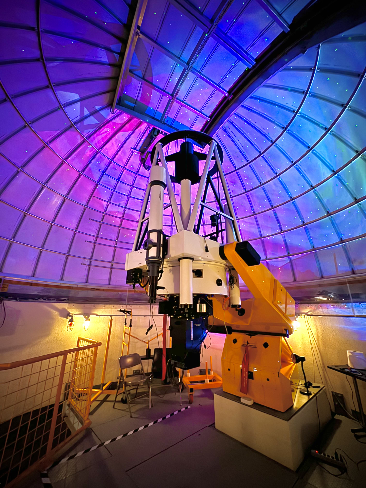
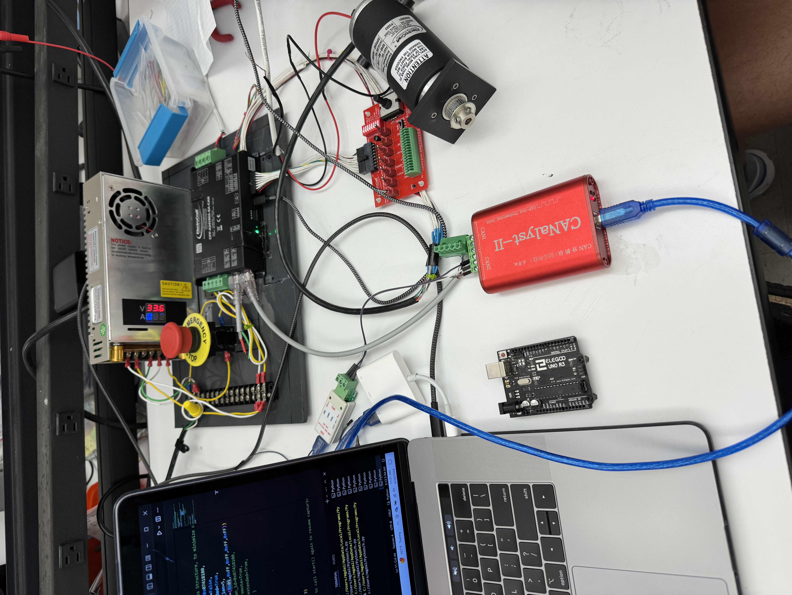
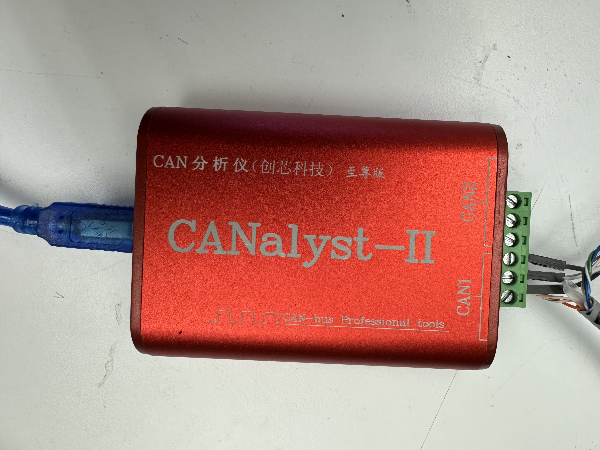
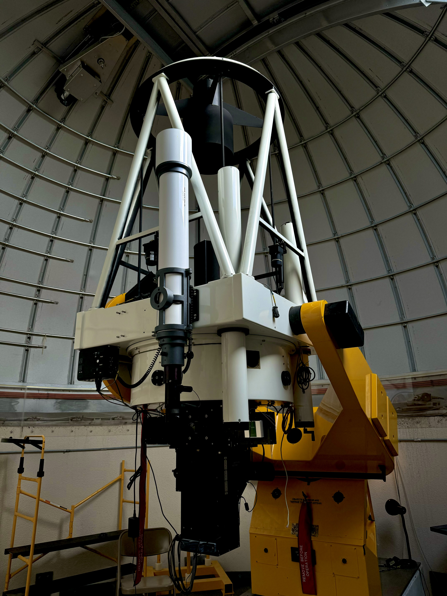

# Fixing-The-Ortega-Observatory
This repository includes the code to control right ascension and declination for the Ortega Observatory. Furthermore, it includes useful information from working with the CAN Bus protocol, specifically through Electrocraft's drivers and motors. Lastly, there are pictures of the telescope, test bench, interfaces used, and a [video](./Media/itworks.mp4) of the code working. 
Keep in mind this code was meant as a proof concept. Meaning the commented code works, but it is not the cleanest. 

